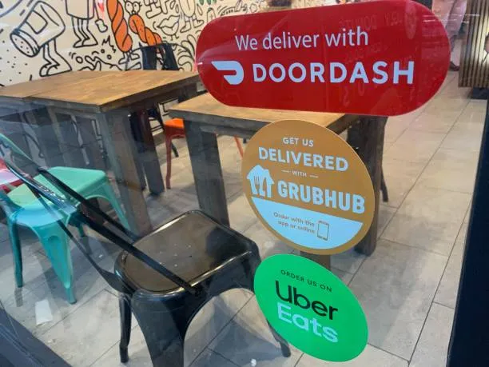
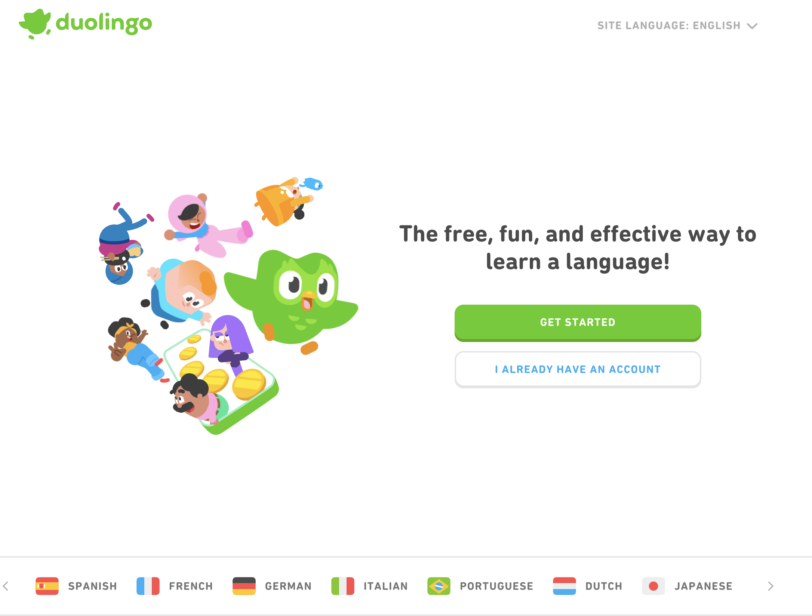
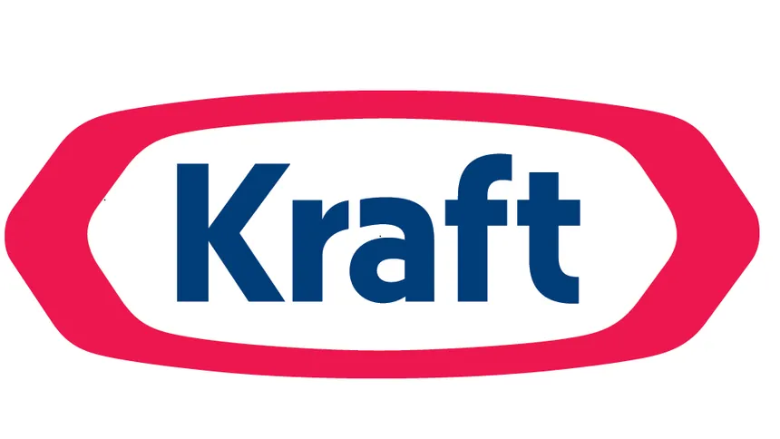

# Pain Points 🥲

---

- You should be thinking of a couple of pain points in your life that you would like to solve with a simple CRUD app.
- It's best to think up more than one idea if you can, so that we have options to choose from.

---
# *Noticing* Pain Points 🥲

> The verb you want to be using with respect to startup ideas is not "think up" but "notice."

— Paul Graham, "[How to Get Startup Ideas](http://paulgraham.com/startupideas.html)"

---

- The essay that quote is from is a good read, but don't (necessarily) try to think up billion dollar startup ideas
- Our goal here is to discover a good first learning project, not to change the world...just yet.
- Try to *notice* a real annoyance at work or at home or with friends that we can solve, even if for just one user — you.

---
# Urgent Problems
> Find someone with a really urgent problem. Imagine your arm is pinned underneath a boulder. You have 2 options. One option is gnaw off your own arm and your other option is to sign an LOI with this promising young startup. That's the kind of customer you want."

- Paul Buchheit, "[The Path to $100B](https://www.youtube.com/watch?v=Ir3hGtg0Wog&t=2910s)"

---

# Vitamin, Pain Killer or Cure?

- Always think about your product or service in terms of the benefits it provides to its users.
- How well does it solve the pain for the customer?

---
# Vitamin
- Indirect, long-term benefits that address general health or minor problems
- Nice to have
- Won’t wreck your day if you forget to take them

---

# Pain Killer
- Necessary short-term fixes to pressing issues
- May not solve the underlying issue

---

# Cure
- Make the problem go away entirely.

---
# Vitamin, Pain Killer or Cure?

- Customers’ willingness to pay (or use) depends directly on their need for your product.
- Pay significantly more for cures than vitamins.

---

> are people deeply passionate about what you're doing? Do customers love your product? I think it's more important to measure love than growth. If people absolutely love your product, they're going to tell other people, and your product is going to grow.
- Brian Chesky (Airbnb)

[source](https://www.inc.com/salvador-rodriguez/brian-chesky-ges-entrepreneurship.html)

<!-- better to have 10 people LOVE your product than 100 who sort of like it -->

---

# Keep it simple
- The best ideas address simple pain points.
 
---

# Let's talk through some examples

- What pain point do they address?
- How do they solve it?
- (Bonus) Is it a vitamin, pain killer, or cure?
---
# DoorDash / GrubHub / UberEats / Chowbus

<!-- 

Pain Point: Difficulty in getting food from favorite restaurants delivered.
Solution: A platform that connects consumers with their favorite local and national restaurants for delivery and takeout.

-->
---
# Zoom

<!-- 
Pain Point: Need for effective remote communication, especially in light of remote work and education trends.

Solution: Provides an easy-to-use video conferencing platform that integrates with multiple systems and allows for widespread collaboration. 

-->

---

# Robinhood

<!--
Pain Point: Traditional stock trading platforms might be complicated or expensive for the average person.

Solution: Offers a free stock trading app that democratizes finance for all.
-->

---
# Instagram

<!-- 
Pain Point: The desire for short, entertaining content on mobile.

Solution: A platform that allows users to create, share, and discover short photos andvideo clips.
-->

---

# Calendly

<!-- 
Pain Point: The back-and-forth of scheduling meetings or appointments.

Solution: Provides a simple way for people to schedule meetings without the email back-and-forth. 
-->

---

# Duolingo

<!-- 
Pain Point: The cost and complexity of learning a new language.

Solution: A gamified language-learning platform that's free and fun. 
-->

---

# Uber

<!-- 
Pain Point: Getting from one place to another is expensive and slow. (Travel)

Solution: A mobile app where a car picks you up and drives you wherever you want to go.
-->

---

# Tesla

---

# John Deere

---

# SAP

---

# BlueCross BlueShield

---

# Kraft Heinz

---

# Milkshake

---

# Understanding the Job

Understanding a product's actual job makes improving the product easier. Clayton Christensen, professor at Harvard Business School, talks about the job to be done in this presentation, [Understanding the Job](https://www.youtube.com/watch?v=sfGtw2C95Ms).
